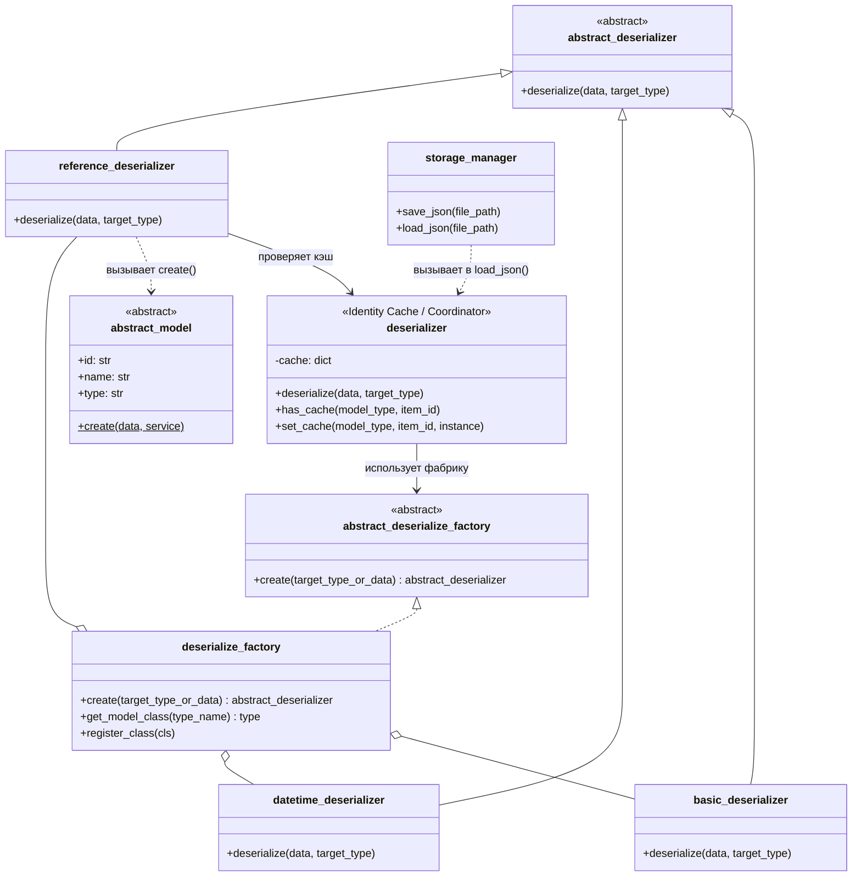

# UML диаграмма десериализации (Задание № 7)

```mermaid
classDiagram
    direction TB

    class abstract_deserializer {
        <<abstract>>
        +deserialize(data, target_type)
    }

    class basic_deserializer {
        +deserialize(data, target_type)
    }

    class datetime_deserializer {
        +deserialize(data, target_type)
    }

    class reference_deserializer {
        +deserialize(data, target_type)
    }

    class abstract_deserialize_factory {
        <<abstract>>
        +create(target_type_or_data) abstract_deserializer
    }

    class deserialize_factory {
        +create(target_type_or_data) abstract_deserializer
        +get_model_class(type_name) type
        +register_class(cls)
    }

    class deserializer {
        <<Identity Cache / Coordinator>>
        -cache: dict
        +deserialize(data, target_type)
        +has_cache(model_type, item_id)
        +set_cache(model_type, item_id, instance)
    }

    class storage_manager {
        +save_json(file_path)
        +load_json(file_path)
    }

    class abstract_model {
        <<abstract>>
        +id: str
        +name: str
        +type: str
        +create(data, service)$
    }

    %% Наследование десериализаторов
    abstract_deserializer <|-- basic_deserializer
    abstract_deserializer <|-- datetime_deserializer
    abstract_deserializer <|-- reference_deserializer

    %% Реализация фабрики
    abstract_deserialize_factory <|.. deserialize_factory

    %% Композиция фабрики
    deserialize_factory o-- basic_deserializer
    deserialize_factory o-- datetime_deserializer
    deserialize_factory o-- reference_deserializer

    %% Связи координатора и моделей
    deserializer --> abstract_deserialize_factory : использует фабрику
    reference_deserializer --> deserializer : проверяет кэш
    storage_manager ..> deserializer : вызывает в load_json()
    reference_deserializer ..> abstract_model : вызывает create()
```
