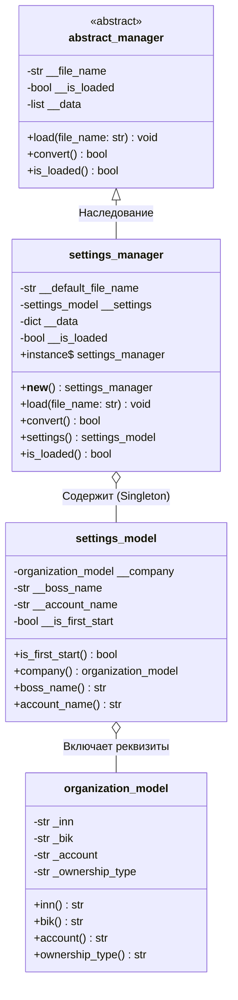
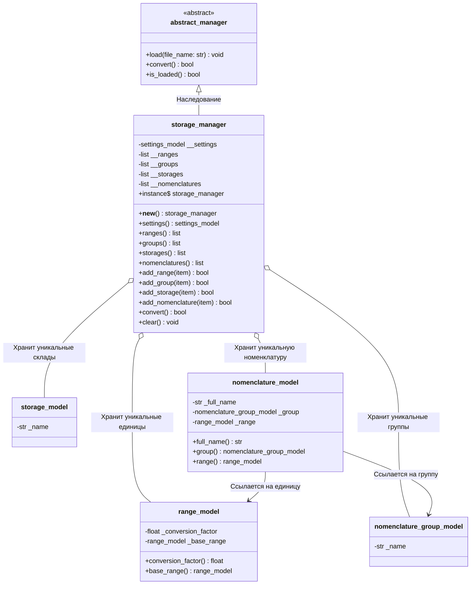

# UML Диаграммы классов: SettingsManager и StorageManager

## 1. Архитектура SettingsManager (Менеджер настроек)

Диаграмма показывает иерархию наследования от `abstract_manager`, реализацию шаблона **Singleton**, а также агрегацию модели настроек `settings_model` и реквизитов организации `organization_model`.

---

## 2. Архитектура StorageManager (Хранилище данных)

Диаграмма показывает структуру хранилища `storage_manager` (Singleton), наследование от `abstract_manager`, связь с `settings_model`, а также хранение коллекций уникальных доменных моделей (`range_model`, `nomenclature_group_model`, `storage_model`, `nomenclature_model`).

